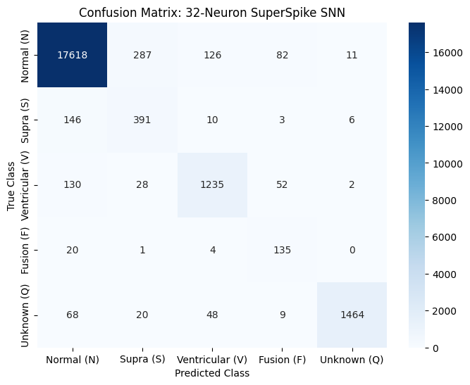

# Baseline Evaluation Report (SuperSpike + van Rossum SNN)

**Date:** October 8, 2026  
**Goal:** Secure the 60-epoch baseline model using SuperSpike and van Rossum distance for hardware deployment on the Spartan-7 FPGA.

## 1. Network Architecture
The network is a pure Spiking Neural Network (SNN) optimized for hardware constraints (0 DSP multipliers, binary spikes, bit-shift friendly leakage).
* **Input Layer:** 128 features (Quantized ECG window)
* **Hidden Layer 1:** 32 Leaky Integrate-and-Fire (LIF) neurons
* **Hidden Layer 2:** 32 LIF neurons
* **Output Layer:** 5 LIF neurons (AAMI classes: N, S, V, F, Q)
* **Time Steps:** 25
* **Membrane Decay ($\beta$):** 0.9375 (Hardware equivalent: `mem - (mem >> 4)`)

## 2. Training Methodology
* **Loss Function:** van Rossum Distance Loss ($\tau = 2.0$)
* **Data Augmentation:** Heavy (Gaussian noise, random cutouts, temporal scaling, beta-mixup) to balance the minority classes to 20,000 samples each.
* **Epochs:** 60
* **Scheduler:** Cosine Annealing LR

## 3. Evaluation Results
The model was evaluated against the clean, unaugmented 20% test split (~22,000 samples).

* **Overall Accuracy:** 95.19%
* **Macro-F1 Score:** 80.10%

### Classification Report
| Class | Precision | Recall | F1-Score | Support |
| :--- | :--- | :--- | :--- | :--- |
| **Normal (N)** | 0.9798 | 0.9721 | 0.9759 | 18124 |
| **Supra (S)** | 0.5378 | 0.7032 | 0.6095 | 556 |
| **Ventricular (V)** | 0.8679 | 0.8535 | 0.8606 | 1447 |
| **Fusion (F)** | 0.4804 | 0.8438 | 0.6122 | 160 |
| **Unknown (Q)** | 0.9872 | 0.9099 | 0.9470 | 1609 |

## 4. Medical & Hardware Analysis
**1. Class Imbalance and Medical Sensitivity:**  
The network demonstrates highly desirable medical characteristics. While the precision for classes 'S' (Supraventricular) and 'F' (Fusion) is around ~50%, the **Recall (Sensitivity) is extremely high (70% and 84%)**. This indicates the network correctly favors false positives over false negatives, ensuring dangerous arrhythmias are flagged rather than ignored. The primary confusion matrix overlap is between 'S' and 'N', which is expected given their morphological similarity on single-lead ECGs.

**2. The Fusion (F) Class Success:**  
With only 160 samples in the test set, the 32-neuron network correctly identified 135 Fusion beats. This proves the data augmentation successfully forced the network to learn the minority class morphology instead of ignoring it.

**3. Hardware Feasibility:**  
Achieving an 80.10% Macro-F1 score with only 32 hidden neurons demonstrates extreme parameter efficiency. The entire weight matrix requires ~5.2 KB, easily fitting within 28% of a single 18Kb BRAM tile on the target Spartan-7 FPGA.

## 5. Confusion Matrix

